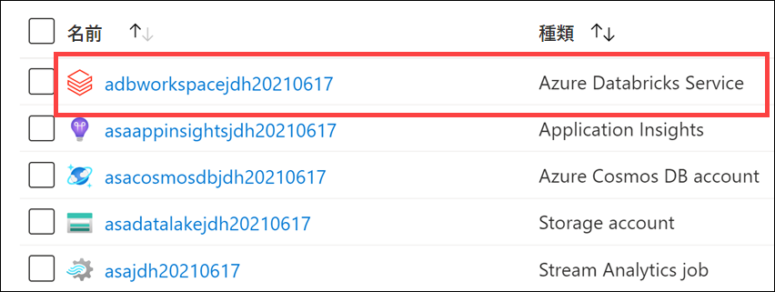
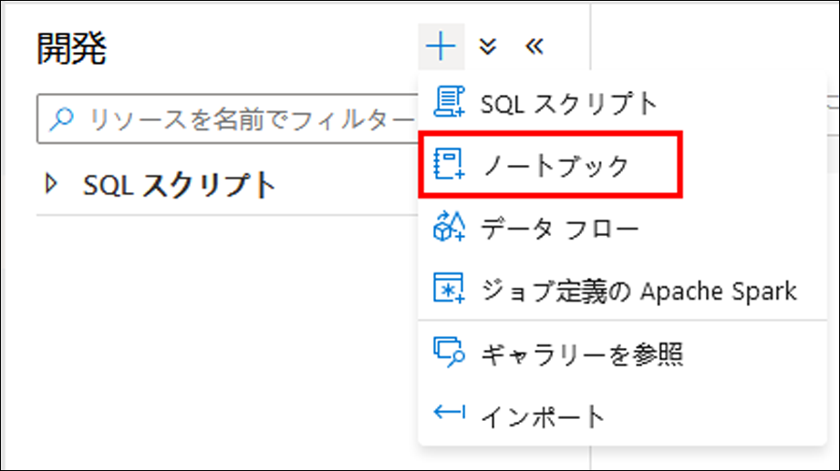
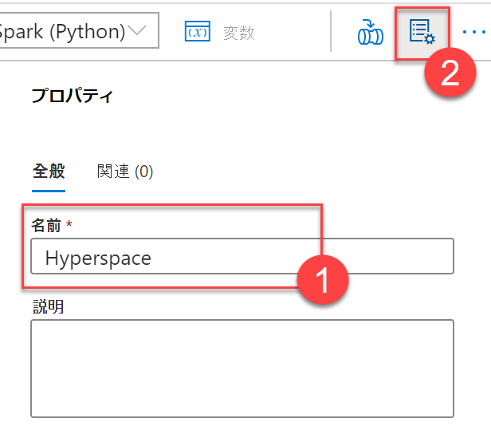
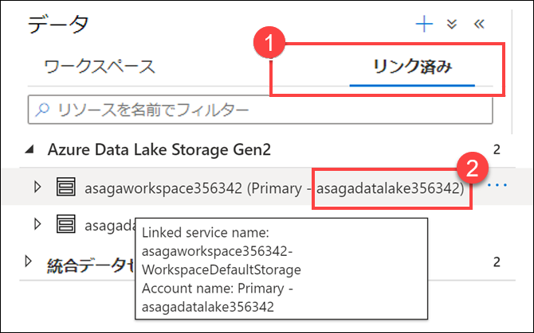
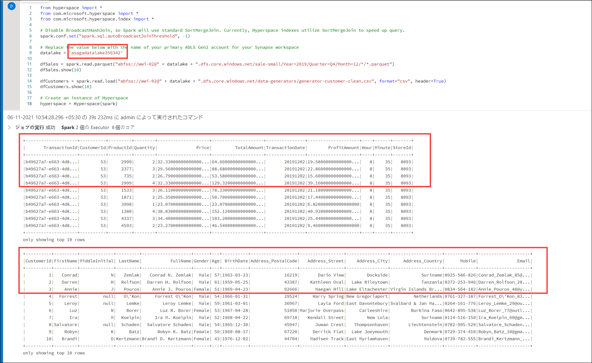
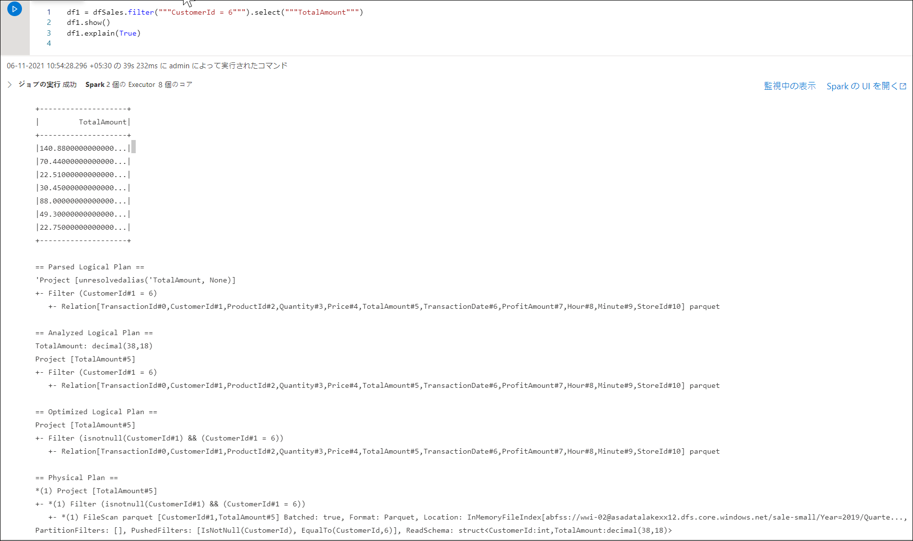
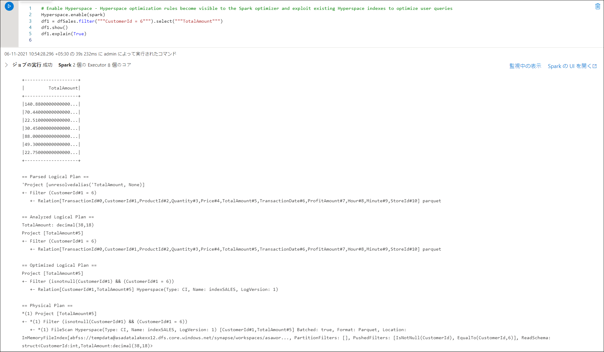
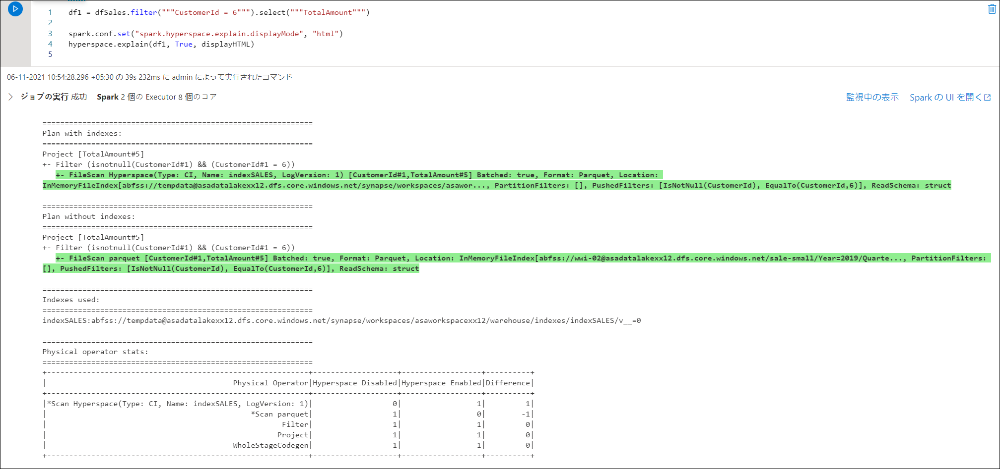
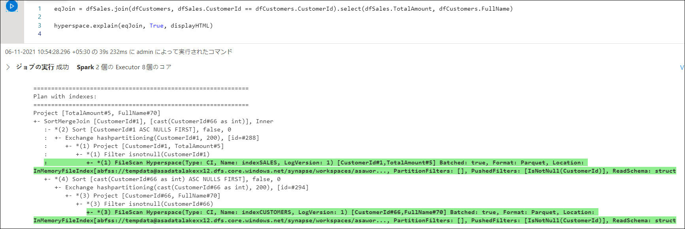

---
lab:
    title: 'データ エンジニアリング ワークロードのコンピューティングおよびストレージ オプションを確認する'
    module: 'モジュール 1'
---

# ラボ 1 - データ エンジニアリング ワークロードのコンピューティングおよびストレージ オプションを確認する

このラボでは、データ レイクを構成し、探索、ストリーミング、バッチ ワークロードに備えてファイルを最適化する方法を説明します。バッチおよびストリーム処理を通してファイルを変換しながら、データを絞り込めるレベルにデータ レイクを整理する方法を学びます。次に、データセットで CSV、JSON、Parquet ファイルのようなデータセットでインデックスを作成し、潜在的なクエリやワークロードのアクセラレーションにこれを使用する方法を学びます。

このラボを完了すると、次のことができるようになります。

- ストリーミングとバッチ処理を 1 つのパイプラインに組み合わせる
- データ レイクをファイル変換のレベルに整理する
- クエリおよびワークロードのアクセラレーション向けにデータ レイク ストレージにインデックスを付ける

## ラボの構成と前提条件

このラボを開始する前に、ラボ環境を作成するためのセットアップ手順が正常に完了していることを確認してください。

## 演習 1 - Delta Lake アーキテクチャ

この演習では、Azure Databricks ワークスペースを使用し、Delta Lake を使ってバッチ ジョブにより構造化ストリーミングを実行します。Databricks Notebooks 内で演習を完了する必要があります。開始するには、Azure Databricks ワークスペースにアクセスできる必要があります。

### タスク 1: Azure Databricks クラスターを作成する

1. `https://portal.azure.com` で Azure portal にサインインし、このコースのセットアップ スクリプトによって作成された **data-engineering-synapse-*xxxxxxx*** リソース グループに移動します。次に、Azure Databricks サービス ワークスペースを選択します。

    

2. 「**ワークスペースの起動**」を選択して、新しいタブで Databricks ワークスペースを開きます。

    

3. Databricks ワークスペースの左側のメニューで、「**コンピューティング**」を選択します。
4. 「**+ クラスターの作成**」をクリックして、新しいクラスターを追加します。

    

5. `Test Cluster` など、クラスターの名前を入力します。
6. **シングル ノード** クラスター モードを選択します。
7. 「**Databricks RuntimeVersion**」を選択します。最新のランタイムと **Scala 2.12** をお勧めします。
8. タイムアウト**後の終了**を 30 分に設定し、既定のノードの種類を選択します。
9. 「**クラスターの作成**」を選択します。
10. クラスターが開始されるまで待ちます。次のタスクに進む前に、クラスターが起動するまで 5 〜 7 分待つ必要があることに注意してください。

### タスク 2: Databricks アーカイブを複製する

1. Azure Databricks ワークスペースの左側のウィンドウで、「**ワークスペース**」 > 「**ユーザー**」を選択し、ユーザー名 (家のアイコンが付いたエントリ) を選択します。
1. 表示されたウィンドウで、ご自分の名前の横にある矢印を選択し、「**インポート**」を選択します。

    

1. 「**ノートブックのインポート**」ダイアログ ボックスで URL を選択し、次の URL 内に貼り付けます。

    ```
    https://github.com/MicrosoftLearning/DP-203-Data-Engineer/raw/master/Allfiles/microsoft-learning-paths-databricks-notebooks/data-engineering/DBC/11-Delta-Lake-Architecture.dbc
    ```

1. 「**インポート**」を選択します。
1. 表示される **11-Delta-Lake-Architecture** フォルダーを選択します。

### タスク 3: *1-Delta-Architecture* ノートブックでコードを実行する

1. **1-Delta-Architecture** ノートブックを開きます。
1. 指示に従い、含まれているセルを実行する前に、クラスターをノートブックに接続します。コード セルを実行するには、実行するセルを選択してから、右上にある **&#x23f5;** ボタンを使用して実行します。

    ノートブック内で、ストリーミングとバッチ処理を 1 つのパイプラインに組み合わせる方法について確認します。

## 重要: クラスターをシャットダウンする

1. Azure Databricks ノートブックの探索が終了したら、Azure Databricks ワークスペースの左側のウィンドウで、「**コンピューティング**」を選択し、クラスターを選択します。次に、「**終了**」を選択してクラスターを停止します。

## 演習 2 - Synapse Analytics で Apache Spark を使用する

この演習では、Azure Synapse Analytics で Apache Spark を使用する方法も説明します。また、Hyperspace や MSSparkUtil のようなライブラリを使用して、Spark ノートブックから Data Lake ストレージ アカウントを使用する方法を最適化します。

演習を完了すると、Azure Synapse Analytics ワークスペースで Spark ライブラリを読み込んで使用する方法を理解できます。

### タスク 1: Hyperspace を使用して Data Lake ストレージにインデックスを付ける

Azure Data Lake Gen 2 からデータを読み込む際は、最もリソースを消費する操作のひとつでデータを検索します。[Hyperspace](https://github.com/microsoft/hyperspace) では、Apache Spark ユーザーがデータセット (CSV、JSON、Parquet など) にインデックスを作成し、クエリやワークロードのアクセラレーションでそれを使用できるようになります。

Hyperspace では、永続的なデータ ファイルからスキャンされたレコードにインデックスを作成できます。正常に作成されると、インデックスに対応するエントリが Hyperspace のメタデータに追加されます。このメタデータは、後でクエリ処理中に Apache Spark のオプティマイザーによって使用され、適切なインデックスを検索して使えるようにします。基になるデータが変更された場合に、それをキャプチャできるよう既存のインデックスを最新の情報に更新します。

また、Hyperspace では、ユーザーはクエリを実行する前に、元のプランと更新されたインデックス依存プランを比較できます。

1. Synapse Studio (`https：//web.azuresynapse.net`) を開き、プロンプトが表示されたら、Azure Active Directory テナント、サブスクリプション、Azure Synapse Analytics ワークスペースを選択します。「当社ではより良い使用体験を提供するためにオプション Cookie を使用します」というプロンプトが表示されたら、「承諾」を選択します。

2. 「**開発**」ハブを選択します。

    

3. 「**+**」、「**ノートブック**」の順に選択し、Synapse ノートブックを新規作成します。

    

4. ノートブックの名前として「**Hyperspace**」と入力し **(1)**、上にある「**プロパティ**」ボタンを選択して **(2)** プロパティ ペインを非表示にします。

    

5. ノートブックを **SparkPool01** に添付し、言語が **PySpark (Python)** に設定されていることを確認します。

    

6. ノートブックの新しいセルに以下のコードを追加します。

```python
from hyperspace import *  
from com.microsoft.hyperspace import *
from com.microsoft.hyperspace.index import *

# Disable BroadcastHashJoin, so Spark will use standard SortMergeJoin. Currently, Hyperspace indexes utilize SortMergeJoin to speed up query.
spark.conf.set("spark.sql.autoBroadcastJoinThreshold", -1)

# Replace the value below with the name of your primary ADLS Gen2 account for your Synapse workspace
datalake = 'asadatalakeSUFFIX'

dfSales = spark.read.parquet("abfss://wwi-02@" + datalake + ".dfs.core.windows.net/sale-small/Year=2019/Quarter=Q4/Month=12/*/*.parquet")
dfSales.show(10)

dfCustomers = spark.read.load("abfss://wwi-02@" + datalake + ".dfs.core.windows.net/data-generators/generator-customer-clean.csv", format="csv", header=True)
dfCustomers.show(10)

# Create an instance of Hyperspace
hyperspace = Hyperspace(spark)
```

7. **datalake** 変数値で、***SUFFIX*** を一意のリソース名拡張子に置き換えて、変数が Azure Data Lake ストレージアカウントの名前 (**asadatalake*xxxxxx*** である必要があります) を表すようにします。

    >    これを確認するには、次の手順を実行します。
    >
    >    1. 「**データ**」ハブに移動します。
    >
    >        
    >
    >    1. 「**リンク**」タブ **(1)** を選択し、Azure Data Lake Storage Gen2 グループを展開します。ワークスペース名の隣のプライマリ ADLS Gen2 name **(2)** をメモします。
    >
    >        

8. 左側の **&#9655;** ボタンを使用するか、**Shift+Enter** を押して、変更したコード セルを実行します。データ レイクからデータのある DataFrame を 2 つ読み込み、Hyperspace を初期化します。

    

    > **注**: ノートブックで初めてセルを実行する場合は、新しい Spark クラスターを起動する必要があるため、数分かかります。その後のセルの実行は、これよりも早くなります。

9. セル出力の下にある「**+ コード**」ボタンを選択して、新しいコード セルを作成します。

10. 次のコードを新しいセルに貼り付けます。

```python
#create indexes: each one contains a name, a set of indexed columns and a set of included columns
indexConfigSales = IndexConfig("indexSALES", ["CustomerId"], ["TotalAmount"])
indexConfigCustomers = IndexConfig("indexCUSTOMERS", ["CustomerId"], ["FullName"])

hyperspace.createIndex(dfSales, indexConfigSales)			# only create index once
hyperspace.createIndex(dfCustomers, indexConfigCustomers)	# only create index once
hyperspace.indexes().show()
```

11. 新しいセルを実行します。2 つのインデックスが作成され、その構造が表示されます。

    

12. 以下のコードを使用してノートブックに別の新しいコード セルを追加します。

```python
df1 = dfSales.filter("""CustomerId = 6""").select("""TotalAmount""")
df1.show()
df1.explain(True)
```

13. 新しいセルを実行します。出力は、物理的な実行プランにインデックスがまったく含まれていないことを示します (オリジナル データ ファイルでファイル スキャンを実行します)。

    

14. ここで以下のコードを使用してノートブックに別の新しいセルを追加します (最初に使われている追加ラインにより Spark エンジンで Hyperspace の最適化が有効になる点に留意してください)。

```python
# Enable Hyperspace - Hyperspace optimization rules become visible to the Spark optimizer and exploit existing Hyperspace indexes to optimize user queries
Hyperspace.enable(spark)
df1 = dfSales.filter("""CustomerId = 6""").select("""TotalAmount""")
df1.show()
df1.explain(True)
```

15. 新しいセルを実行します。出力は、物理的な実行プランがオリジナル データ ファイルではなく、インデックスを使用していることを示します。

    

16. Hyperspace は Explain API を提供するので、インデックスのない実行計画とインデックスのある実行計画を比較できます。以下のコードを使用して新しいセルを追加します。

```python
df1 = dfSales.filter("""CustomerId = 6""").select("""TotalAmount""")

spark.conf.set("spark.hyperspace.explain.displayMode", "html")
hyperspace.explain(df1, True, displayHTML)
```

17. 新しいセルを実行します。出力は`Plan with indexes`と`Plan without indexes`の比較を示します。最初のケースで、インデックス ファイルがどのように使用されているのか、また 2 番目のケースではオリジナル データ ファイルが使用されていることを観察してください。

    

18. それでは、join 操作を含む、より複雑なケースを調べてみましょう。以下のコードを使用して新しいセルを追加します。

```python
eqJoin = dfSales.join(dfCustomers, dfSales.CustomerId == dfCustomers.CustomerId).select(dfSales.TotalAmount, dfCustomers.FullName)

hyperspace.explain(eqJoin, True, displayHTML)
```

19. 新しいセルを実行します。出力には再び`Plan with indexes`と`Plan without indexes`の比較が表示され、インデックスは最初のケース、オリジナル データ ファイルは 2 番目のケースで使用されています。

    

20. Hyperspace を非アクティブ化し、インデックスをクリーンアップするには、次のコードで新しいセルを追加して実行します。

```python
# Disable Hyperspace - Hyperspace rules no longer apply during query optimization. Disabling Hyperspace has no impact on created indexes because they remain intact
Hyperspace.disable(spark)

hyperspace.deleteIndex("indexSALES")
hyperspace.vacuumIndex("indexSALES")
hyperspace.deleteIndex("indexCUSTOMERS")
hyperspace.vacuumIndex("indexCUSTOMERS")
```

### タスク 2: MSSparkUtil ライブラリを使用して Data Lake ストレージを探索する

Microsoft Spark Utilities (MSSparkUtils) は、一般的なタスクを簡単に実行できるようにするための組み込みパッケージです。MSSparkUtils は、ファイルシステムの操作や環境変数の取得、シークレットの処理で使用できます。

1. 前のタスクと同じノートブックを使い、以下のコードで新しいセルを追加します。

```python
from notebookutils import mssparkutils

#
# Microsoft Spark Utilities
#
# https://docs.microsoft.com/en-us/azure/synapse-analytics/spark/microsoft-spark-utilities?pivots=programming-language-python
#

# Azure storage access info
blob_account_name = datalake
blob_container_name = 'wwi-02'
blob_relative_path = '/'
linkedServiceName = datalake
blob_sas_token = mssparkutils.credentials.getConnectionStringOrCreds(linkedServiceName)

# Allow SPARK to access from Blob remotely
spark.conf.set('fs.azure.sas.%s.%s.blob.core.windows.net' % (blob_container_name, blob_account_name), blob_sas_token)

files = mssparkutils.fs.ls('/')
for file in files:
    print(file.name, file.isDir, file.isFile, file.path, file.size)

mssparkutils.fs.mkdirs('/SomeNewFolder')

files = mssparkutils.fs.ls('/')
for file in files:
    print(file.name, file.isDir, file.isFile, file.path, file.size)
```

2. 新しいセルを実行し、ファイル システムの操作で MSSparkUtils がどのように使われているのか観察してください。

### タスク 3 セッションを停止する

1. ノートブックの右上にある「**セッションの停止**」ボタンを使用して、ノートブック セッションを停止します。
1. 後でもう一度確認する場合は、ノートブックを公開します。次に、それを閉じます。

## リソース

このラボで取り上げたトピックの詳細については、以下のリソースを参照してください。

- [Azure Synapse Analytics での Apache Spark](https://docs.microsoft.com/azure/synapse-analytics/spark/apache-spark-overview)
- [Azure Synapse 向けに Azure Data Explorer データ コネクタを発表する](https://techcommunity.microsoft.com/t5/azure-data-explorer/announcing-azure-data-explorer-data-connector-for-azure-synapse/ba-p/1743868)
- [Apache Spark for Azure Synapse Analytics を使用して Azure Data Explorer に接続する](https://docs.microsoft.com/azure/synapse-analytics/quickstart-connect-azure-data-explorer)
- [Azure Synapse Analytics の共有メタデータ](https://docs.microsoft.com/azure/synapse-analytics/metadata/overview)
- [Microsoft Spark Utilities の概要](https://docs.microsoft.com/azure/synapse-analytics/spark/microsoft-spark-utilities?pivots=programming-language-python)
- [Hyperspace - Apache Spark™ とビッグ データ ワークロードでインデックス ベースのクエリ アクセラレーションを可能にするオープン ソースのインデックス作成サブシステム](https://github.com/microsoft/hyperspace)
