---
lab:
    title: 'データ ウェアハウスにデータを取り込んで読み込む'
    module: 'モジュール 5'
---

# ラボ 5 - データ ウェアハウスにデータを取り込んで読み込む

このラボでは、T-SQL スクリプトと Synapse Analytics 統合パイプラインを介してデータ ウェアハウスにデータを取り込む方法を説明します。受講者は、T-SQL を使用して PolyBase と COPY で Synapse 専用 Synapse SQLプールにデータを読み込む方法を学びます。また、ペタバイト スケールのデータ インジェスト向けに Azure Synapse パイプラインでコピー アクティビティとともにワークロード管理を使用する方法も学習します

このラボを完了すると、次のことができるようになります。

- Azure Synapse パイプラインを使用してペタバイト規模のインジェストを行う
- T-SQL を使用して PolyBase と COPY でデータをインポートする
- Azure Synapse Analytics でデータ読み込みのベスト プラクティスを使用する

## ラボの構成と前提条件

このラボを開始する前に、**ラボ 4: *Apache Spark を使用してデータの探索と変換を行い、データ ウェアハウスに読み込む***を完了してください。

このラボでは、前のラボで作成した専用 SQL プールを使用します。前のラボの最後で SQL プールを一時停止しているはずなので、次の手順に従って再開します。

1. Synapse Studio (<https://web.azuresynapse.net/>) を開きます。
2. 「**管理**」ハブを選択します。
3. 左側のメニューで「**SQL プール**」を選択します。**SQLPool01** 専用 SQL プールが一時停止状態の場合は、名前の上にマウスを動かして、「**&#9655;**」を選択します。

    

4. プロンプトが表示されたら、「**再開**」を選択します。プールが再開するまでに、1 ～ 2 分かかります。

> **重要:** 開始されると、専用 SQL プールは、一時停止されるまで Azure サブスクリプションのクレジットを消費します。このラボを休憩する場合、またはラボを完了しないことにした場合は、ラボの最後にある指示に従って、SQL プールを一時停止してください。

## 演習 1 - T-SQL を使用して PolyBase と COPY でデータをインポートする

大量のデータを Azure Synapse Analytics に読み込むさまざまなオプションがあり、データ型も各種あります。Synapse SQL プールを使用した T-SQL コマンドや、Azure Synapse パイプラインの使用が挙げられます。このシナリオでは、Wide World Importers がほとんどの生データをさまざまな形式でデータ レイクに格納しています。WWI のデータ エンジニアは利用可能なデータ読み込みオプションのうち、T-SQL の使用に最も慣れています。

ただし、SQL によく慣れていても、大きなファイルやさまざまな種類と形式のファイルを読み込む際には考慮に入れるべきことがいくつかあります。ファイルは ADLS Gen2 に格納されているため、WWI は PolyBase 外部テーブルまたは新しい COPY ステートメントを使用できます。どちらのオプションでも、迅速でスケーラブルなデータ読み込みオプションが可能ですが、両者の合谷はいくつか異なる点があります。

| PolyBase | COPY |
| --- | --- |
| CONTROL 許可が必要 | 緩い許可 |
| 行の幅に制限がある | 行の幅に制限はない |
| テキスト内に区切り記号がない | テキストの区切り記号に対応 |
| ライン区切り記号は固定 | 列と行のカスタム区切り記号に対応 |
| コードでの設定が複雑 | コードの量は低減 |

WWI は、一般的に PolyBase の方が COPY よりも早いという情報を得ました。特に大きなデータ セットを使用する場合です。

この演習では、WWI がこれらの読み込み方法で設定の容易さや柔軟性、スピードを比べられるよう支援します。

### タスク 1: ステージング テーブルを作成する

**Sale** テーブルには、読み取り中心のワークロードで最適化できるよう列ストア インデックスが含まれています。また、クエリの報告やアドホック クエリでもよく使われます。読み込み速度を最速にして、**Sale** テーブルでの大量のデータ挿入の影響を最小限に抑えるため、WWI は読み込みのステージング テーブルを作成することにしました。

このタスクでは、**SaleHeap** という名前の新しいステージング テーブルを **wwi_staging** スキーマで作成します。これを[ヒープ](https://docs.microsoft.com/sql/relational-databases/indexes/heaps-tables-without-clustered-indexes?view=sql-server-ver15)として定義し、ラウンド ロビン分散を使用する必要があります。WWI はデータ読み込みパイプラインを最終的に決定すると、**SaleHeap** にデータを読み込んだ後、ヒープ テーブルから **Sale** に挿入する予定です。これは 2 段階のプロセスですが、行を運用テーブルに挿入する 2 番目の手順では、分散全体でデータの移動は発生しません。

また、**wwi_staging** スキーマ内で新しい **Sale** クラスター化列ストア テーブルを作成し、データ読み込み速度を比較します。

1. Synapse Studio で「**開発**」ハブに移動します。

    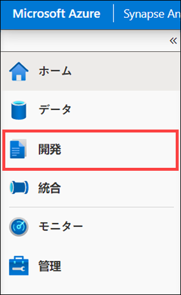

2. 「**+**」メニューで、「**SQL スクリプト**」を選択します。

    

3. ツールバー メニューで、**SQLPool01** データベースに接続します。

    

4. クエリ ウィンドウで、次のコードを入力して、**wwi_staging** スキーマが存在することを確認します。

    ```sql
    SELECT * FROM sys.schemas WHERE name = 'wwi_staging'
    ```

5. ツールバー メニューから「**実行**」を選択してスクリプトを実行します。

    

    結果には、前のラボのセットアップ時に作成された **wwi_staging** スキーマの単一の行が含まれている必要があります。

6. クエリ ウィンドウでスクリプトを以下に置き換えて、ヒープ テーブルを作成します。

    ```sql
    CREATE TABLE [wwi_staging].[SaleHeap]
    ( 
        [TransactionId] [uniqueidentifier]  NOT NULL,
        [CustomerId] [int]  NOT NULL,
        [ProductId] [smallint]  NOT NULL,
        [Quantity] [smallint]  NOT NULL,
        [Price] [decimal](9,2)  NOT NULL,
        [TotalAmount] [decimal](9,2)  NOT NULL,
        [TransactionDate] [int]  NOT NULL,
        [ProfitAmount] [decimal](9,2)  NOT NULL,
        [Hour] [tinyint]  NOT NULL,
        [Minute] [tinyint]  NOT NULL,
        [StoreId] [smallint]  NOT NULL
    )
    WITH
    (
        DISTRIBUTION = ROUND_ROBIN,
        HEAP
    )
    ```

7. SQL スクリプトを実行して、テーブルを作成します。

8. クエリ ウィンドウでスクリプトを以下に置き換え、読み込みの比較用に **wwi_staging** スキーマで **Sale** テーブルを作成します。

    ```sql
    CREATE TABLE [wwi_staging].[Sale]
    (
        [TransactionId] [uniqueidentifier]  NOT NULL,
        [CustomerId] [int]  NOT NULL,
        [ProductId] [smallint]  NOT NULL,
        [Quantity] [smallint]  NOT NULL,
        [Price] [decimal](9,2)  NOT NULL,
        [TotalAmount] [decimal](9,2)  NOT NULL,
        [TransactionDate] [int]  NOT NULL,
        [ProfitAmount] [decimal](9,2)  NOT NULL,
        [Hour] [tinyint]  NOT NULL,
        [Minute] [tinyint]  NOT NULL,
        [StoreId] [smallint]  NOT NULL
    )
    WITH
    (
        DISTRIBUTION = HASH ( [CustomerId] ),
        CLUSTERED COLUMNSTORE INDEX,
        PARTITION
        (
            [TransactionDate] RANGE RIGHT FOR VALUES (20100101, 20100201, 20100301, 20100401, 20100501, 20100601, 20100701, 20100801, 20100901, 20101001, 20101101, 20101201, 20110101, 20110201, 20110301, 20110401, 20110501, 20110601, 20110701, 20110801, 20110901, 20111001, 20111101, 20111201, 20120101, 20120201, 20120301, 20120401, 20120501, 20120601, 20120701, 20120801, 20120901, 20121001, 20121101, 20121201, 20130101, 20130201, 20130301, 20130401, 20130501, 20130601, 20130701, 20130801, 20130901, 20131001, 20131101, 20131201, 20140101, 20140201, 20140301, 20140401, 20140501, 20140601, 20140701, 20140801, 20140901, 20141001, 20141101, 20141201, 20150101, 20150201, 20150301, 20150401, 20150501, 20150601, 20150701, 20150801, 20150901, 20151001, 20151101, 20151201, 20160101, 20160201, 20160301, 20160401, 20160501, 20160601, 20160701, 20160801, 20160901, 20161001, 20161101, 20161201, 20170101, 20170201, 20170301, 20170401, 20170501, 20170601, 20170701, 20170801, 20170901, 20171001, 20171101, 20171201, 20180101, 20180201, 20180301, 20180401, 20180501, 20180601, 20180701, 20180801, 20180901, 20181001, 20181101, 20181201, 20190101, 20190201, 20190301, 20190401, 20190501, 20190601, 20190701, 20190801, 20190901, 20191001, 20191101, 20191201)
        )
    )
    ```

9. スクリプトを実行して、テーブルを作成します。

### タスク 2: PolyBase 読み込み操作を設定して実行する

PolyBase では以下の要素が必要です。

- Parquet ファイルがある ADLS Gen2 で **abfss** パスを指す外部データ ソース
- Parquet ファイルの外部ファイル形式
- ファイルのスキーマのほか、場所、データ ソース、ファイル形式を定義する外部テーブル

1. クエリ ウィンドウでスクリプトを以下のコードに置き換えて、外部データ他のデータ ソースを作成します。このラボでは、必ず ***SUFFIX*** を Azure リソースの一意のサフィックスに置き換えてください。

    ```sql
    -- Replace SUFFIX with the lab workspace id.
    CREATE EXTERNAL DATA SOURCE ABSS
    WITH
    ( TYPE = HADOOP,
        LOCATION = 'abfss://wwi-02@asadatalakeSUFFIX.dfs.core.windows.net'
    );
    ```

    Synapse Analytics ワークスペース名の最後にサフィックスがあります。

    

2. スクリプトを実行して、外部データ ソースを作成します。

3. クエリ ウィンドウで、スクリプトを以下のコードに置き換えて、外部ファイル形式と外部データ テーブルを作成します。**TransactionId** が **uniqueidentifier** ではなく、**nvarchar(36)** フィールドとして定義されている点に留意してください。外部テーブルは現在、**uniqueidentifier** 列をサポートしていないためです。

    ```sql
    CREATE EXTERNAL FILE FORMAT [ParquetFormat]
    WITH (
        FORMAT_TYPE = PARQUET,
        DATA_COMPRESSION = 'org.apache.hadoop.io.compress.SnappyCodec'
    )
    GO

    CREATE SCHEMA [wwi_external];
    GO

    CREATE EXTERNAL TABLE [wwi_external].Sales
        (
            [TransactionId] [nvarchar](36)  NOT NULL,
            [CustomerId] [int]  NOT NULL,
            [ProductId] [smallint]  NOT NULL,
            [Quantity] [smallint]  NOT NULL,
            [Price] [decimal](9,2)  NOT NULL,
            [TotalAmount] [decimal](9,2)  NOT NULL,
            [TransactionDate] [int]  NOT NULL,
            [ProfitAmount] [decimal](9,2)  NOT NULL,
            [Hour] [tinyint]  NOT NULL,
            [Minute] [tinyint]  NOT NULL,
            [StoreId] [smallint]  NOT NULL
        )
    WITH
        (
            LOCATION = '/sale-small/Year=2019',  
            DATA_SOURCE = ABSS,
            FILE_FORMAT = [ParquetFormat]  
        )  
    GO
    ```

    > **注:** */sale-small/Year=2019/* フォルダーの Parquet ファイルには **4,124,857 行**が含まれています。

4. スクリプトを実行します。

5. クエリ ウィンドウで、スクリプトを以下のコードに置き換えて、**wwi_staging.SalesHeap** テーブルにデータを読み込みます。

    ```sql
    INSERT INTO [wwi_staging].[SaleHeap]
    SELECT *
    FROM [wwi_external].[Sales]
    ```

6. スクリプトを実行します。完了するまで時間がかかる場合があります。

7. クエリ ウィンドウで、スクリプトを以下に置き換えて、インポートされた行数を確認します。

    ```sql
    SELECT COUNT(1) FROM wwi_staging.SaleHeap(nolock)
    ```

8. スクリプトを実行します。4124857 という結果が表示されるはずです。

### タスク 3: COPY ステートメントを設定して実行する

それでは、COPY ステートメントを使用して同じ読み込み操作を行う方法を見てみましょう。

1. クエリ ウィンドウでスクリプトを以下に置き換え、COPY ステートメントを使用してヒープ テーブルを切り詰め、データを読み込みます。以前と同様に、必ず***SUFFIX***を一意のサフィックスに置き換えてください。

    ```sql
    TRUNCATE TABLE wwi_staging.SaleHeap;
    GO

    -- Replace SUFFIX with the unique suffix for your resources
    COPY INTO wwi_staging.SaleHeap
    FROM 'https://asadatalakeSUFFIX.dfs.core.windows.net/wwi-02/sale-small/Year=2019'
    WITH (
        FILE_TYPE = 'PARQUET',
        COMPRESSION = 'SNAPPY'
    )
    GO
    ```

2. スクリプトを実行します。同様の読み込み操作を実行するために必要なスクリプトが少ないことに注意してください。

3. クエリ ウィンドウで、スクリプトを以下に置き換えて、インポートされた行数を確認します。

    ```sql
    SELECT COUNT(1) FROM wwi_staging.SaleHeap(nolock)
    ```

4. スクリプトを実行します。ここでも、4124857 行がインポートされているはずです。両方の読み込み操作が、ほぼ同じ時間で同じ量のデータをコピーしたことに注意してください。

### タスク 4: COPY を使用して非標準行区切りでテキスト ファイルを読み込む

PolyBase に対する COPY の利点のひとつは、列および行のカスタム区切り記号に対応する点です。

WWI では毎晩、パートナーの分析システムから地域の売上データを取り込み、データ レイクにファイルを保存しています。テキスト ファイルでは、列と行の非標準区切り記号を使用しており、列の区切りはピリオド、行の区切りはカンマです:

```
20200421.114892.130282.159488.172105.196533,20200420.109934.108377.122039.101946.100712,20200419.253714.357583.452690.553447.653921
```

データには以下のフィールドが含まれています: **Date**、**NorthAmerica**、**SouthAmerica**、**Europe**、**Africa**、**Asia**。このデータを処理して Synapse Analytics に格納する必要があります。

1. クエリ ウィンドウでスクリプトを以下に置換、**DailySalesCounts** テーブルを作成し、COPY ステートメントを使用してデータを読み込んでください。以前と同様に、必ず***SUFFIX***を一意のサフィックスに置き換えてください。

    ```sql
    CREATE TABLE [wwi_staging].DailySalesCounts
        (
            [Date] [int]  NOT NULL,
            [NorthAmerica] [int]  NOT NULL,
            [SouthAmerica] [int]  NOT NULL,
            [Europe] [int]  NOT NULL,
            [Africa] [int]  NOT NULL,
            [Asia] [int]  NOT NULL
        )
    GO

    -- Replace SUFFIX with the unique suffix for your resources
    COPY INTO wwi_staging.DailySalesCounts
    FROM 'https://asadatalakeSUFFIX.dfs.core.windows.net/wwi-02/campaign-analytics/dailycounts.txt'
    WITH (
        FILE_TYPE = 'CSV',
        FIELDTERMINATOR='.',
        ROWTERMINATOR=','
    )
    GO
    ```

    FIELDTERMINATO と ROWTERMINATOR のプロパティは、ファイルを適正に解析する上で役立つことがわかります。

2. スクリプトを実行します。

3. クエリ ウィンドウでスクリプトを以下に置き換えて、インポートされたデータを表示します。

    ```sql
    SELECT * FROM [wwi_staging].DailySalesCounts
    ORDER BY [Date] DESC
    ```

4. スクリプトを実行して結果を確認します。

5. グラフで結果を表示し、「**カテゴリ列**」を **Date** に設定してみてください。

    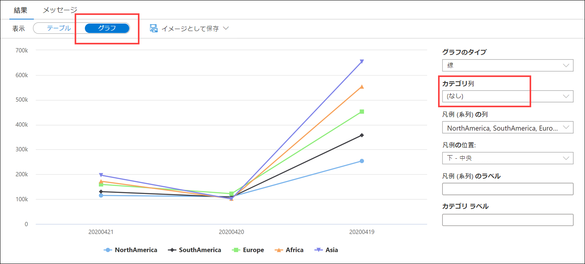

### タスク 5: PolyBase を使用して非標準行区切りでテキスト ファイルを読み込む

PolyBase を使用して同じ操作を試してみましょう。

1. クエリ ウィンドウでスクリプトを以下に置き換え、PolyBase を使用して新しい外部ファイル形式、外部テーブルを作成し、データを読み込みます。

    ```sql
    CREATE EXTERNAL FILE FORMAT csv_dailysales
    WITH (
        FORMAT_TYPE = DELIMITEDTEXT,
        FORMAT_OPTIONS (
            FIELD_TERMINATOR = '.',
            DATE_FORMAT = '',
            USE_TYPE_DEFAULT = False
        )
    );
    GO

    CREATE EXTERNAL TABLE [wwi_external].DailySalesCounts
        (
            [Date] [int]  NOT NULL,
            [NorthAmerica] [int]  NOT NULL,
            [SouthAmerica] [int]  NOT NULL,
            [Europe] [int]  NOT NULL,
            [Africa] [int]  NOT NULL,
            [Asia] [int]  NOT NULL
        )
    WITH
        (
            LOCATION = '/campaign-analytics/dailycounts.txt',  
            DATA_SOURCE = ABSS,
            FILE_FORMAT = csv_dailysales
        )  
    GO
    INSERT INTO [wwi_staging].[DailySalesCounts]
    SELECT *
    FROM [wwi_external].[DailySalesCounts]
    ```

2. スクリプトを実行します。以下のようなエラーが表示されるはずです:

    *クエリを実行できませんでした。エラー: HdfsBridge::recordReaderFillBuffer - Unexpected error encountered filling record reader buffer: HadoopExecutionException: Too many columns in the line.*.

    なぜ難しいのでしょうか。[PolyBase ドキュメント](https://docs.microsoft.com/sql/t-sql/statements/create-external-file-format-transact-sql?view=sql-server-ver15#limitations-and-restrictions)を参照してください。

    > 区切りテキスト ファイルの行区切り記号は、Hadoop の LineRecordReader でサポートされている必要があります。つまり、**\r**、**\n**、**\r\n** のいずれかでなければなりません。これらの区切り記号をユーザーが構成することはできません。

    これは、PolyBase に比べて COPY の柔軟性が際立つ例です。

3. 次の演習のためにスクリプトは開いたままにしておきます。

## 演習 2 - Azure Synapse パイプラインを使用してペタバイト規模のインジェストを行う

Tailwind Traders は大量の売上データをデータ ウェアハウスに取り込む必要があります。反復可能なプロセスで、効率よくデータを読み込むことを希望しています。データを読み込む際には、データ移動ジョブを優先したいと考えています。

あなたは、大量の Parquet ファイルをインポートするための概念実証データ パイプラインを作成した後、読み込みのパフォーマンスを向上させるためのベスト プラクティスを作成することにしました。

データをデータ ウェアハウスに移送する際は頻繁に、ある程度の調整が必要で、ひとつまたは複数のデータ ソースからの移動をコーディネートしなくてはなりません。何らかの変換が必要なこともあります。変換手順はデータの移動中 (extract-transform-load - ETL) または移動後 (extract-load-transform - ELT) に実施できます。最新のデータ プラットフォームでは、抽出や解析、結合、標準化、強化、クレンジング、統合、フィルタリングといった一般的なデータ ラングリング操作すべてをシームレスに行う必要があります。Azure Synapse Analytics には、2 つの重要な機能のカテゴリが含まれています。データ フローとデータ調整 (パイプラインとして実装) です。

> この演習では、調整に焦点を当てます。後のラボでは、変換 (データ フロー) パイプラインに注目します。

### タスク 1: ワークロード管理分類を構成する

大量のデータを読み込む場合、最速のパフォーマンスにするため、一度にひとつの読み込みジョブのみを実行することがベストです。これが可能でない場合は、同時に実行する読み込みの数を最小限に抑えてください。大規模な読み込みジョブが予想される場合は、読み込み前に専用 SQL プールをスケール アップすることを検討してください。

パイプライン セッションには必ず十分なメモリを配分してください。これを実行するには、次のテーブルのインデックスを再構築するためのアクセス許可を持っているユーザーのリソース クラスを、推奨される最小値に変更します。

適切なコンピューティング リソースで読み込みを実行するには、読み込みを実行するように指定された読み込みユーザーを作成します。特定のリソース クラスまたはワークロード グループに各読み込みユーザーを割り当てます。読み込みを実行するには、いずれかの読み込みユーザーとしてサインインし、読み込みを実行します。読み込みは、ユーザーのリソース クラスで実行されます。

1. 前の演習で使用した SQL スクリプト クエリ ウィンドウで、スクリプトを次のように置き換えて作成します。
    - 100% の上限で最低 50% のリソースを予約することにより、ワークロードの分離を使用するワークロード グループ **BigDataLoad**
    - **asa.sql.import01** ユーザーを **BigDataLoad** ワークロード グループに割り当てる新しいワークロード分類子 **HeavyLoader**
    
    最後に **sys.workload_management_workload_classifiers** から選択して、作成したばかりの分類子を含むあらゆる分類子を表示します。

    ```sql
    -- Drop objects if they exist
    IF EXISTS (SELECT * FROM sys.workload_management_workload_classifiers WHERE [name] = 'HeavyLoader')
    BEGIN
        DROP WORKLOAD CLASSIFIER HeavyLoader
    END;
    
    IF EXISTS (SELECT * FROM sys.workload_management_workload_groups WHERE name = 'BigDataLoad')
    BEGIN
        DROP WORKLOAD GROUP BigDataLoad
    END;
    
    --Create workload group
    CREATE WORKLOAD GROUP BigDataLoad WITH
      (
          MIN_PERCENTAGE_RESOURCE = 50, -- integer value
          REQUEST_MIN_RESOURCE_GRANT_PERCENT = 25, --  (guaranteed min 4 concurrency)
          CAP_PERCENTAGE_RESOURCE = 100
      );
    
    -- Create workload classifier
    CREATE WORKLOAD Classifier HeavyLoader WITH
    (
        Workload_Group ='BigDataLoad',
        MemberName='asa.sql.import01',
        IMPORTANCE = HIGH
    );
    
    -- View classifiers
    SELECT * FROM sys.workload_management_workload_classifiers
    ```

2. スクリプトを実行し、必要に応じて、結果を**テーブル** ビューに切り替えます。クエリ結果に新しい **HeavyLoader** 分類子が表示されます。

    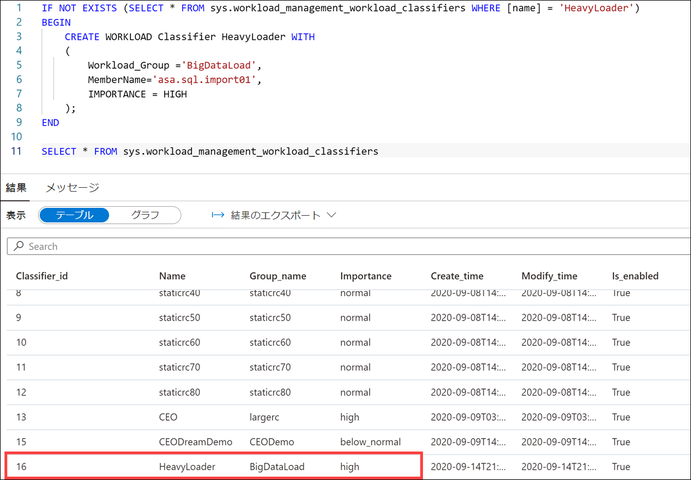

3. 「**管理**」ハブに移動します。

    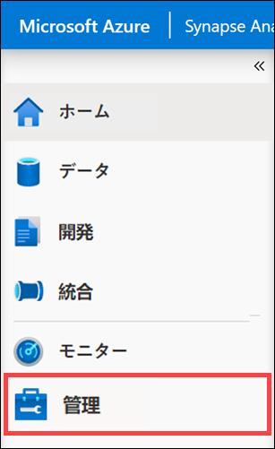

4. 左側のメニューで「**リンク サービス**」を選択してから、**sqlpool01_import01** リンク サービスを選択します (これが表示されていない場合は、左上の「**&#8635;**」ボタンを使用してビューを更新します)。

    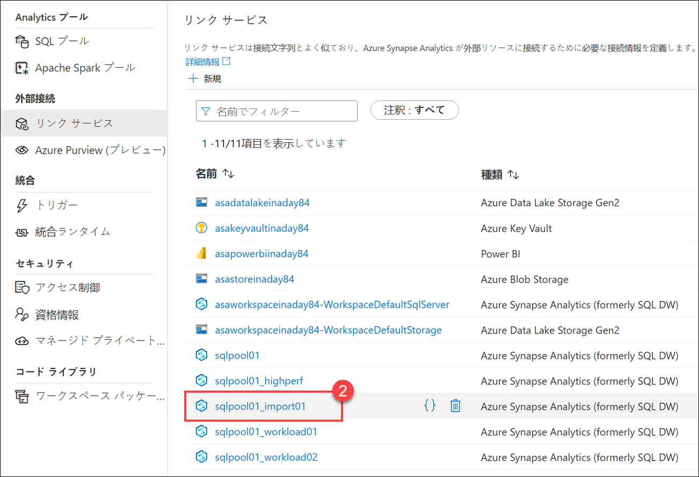

5. 専用 SQL プール接続のユーザー名が、**HeavyLoader** 分類子に追加した **asa.sql.import01** ユーザーになっていることがわかります。新しいパイプラインでこのリンク サービスを使用して、データ読み込みアクティビティのリソースを予約します。

    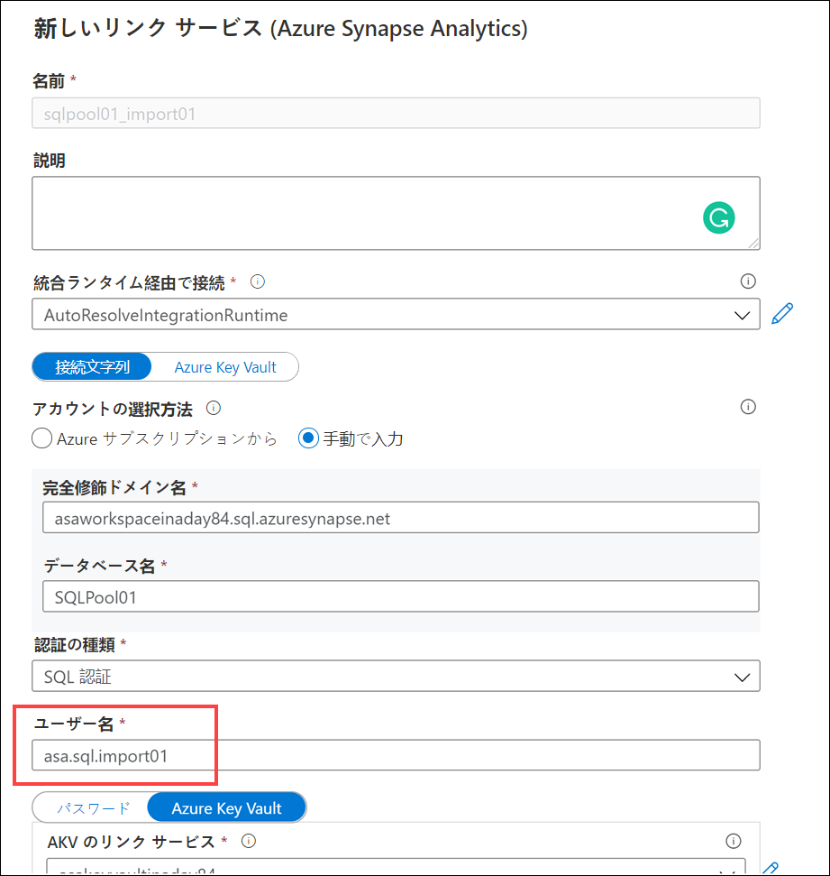

6. 「**キャンセル**」を選択してダイアログを閉じ、プロンプトが表示されたら「**変更を破棄する**」を選択します。

### タスク 2: コピー アクティビティを含むパイプラインを作成する

1. 「**統合**」ハブに移動します。

    

2. 「**+**」メニューで、「**パイプライン**」を選択して新しいパイプラインを作成します。

    

3. 新しいパイプラインの「**プロパティ**」ウィンドウで、パイプラインの**名前**を「**`Copy December Sales`**」に設定します。

    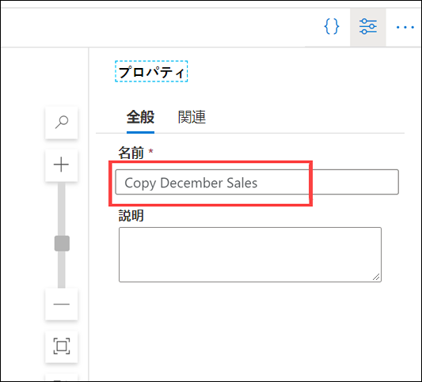

    > **ヒント**: 名前を設定したら、「**プロパティ**」ウィンドウを非表示にします。

4. アクティビティ リスト内で「**移動と変換**」を展開し、「**データのコピー**」アクティビティをパイプライン キャンバスにドラッグします。

    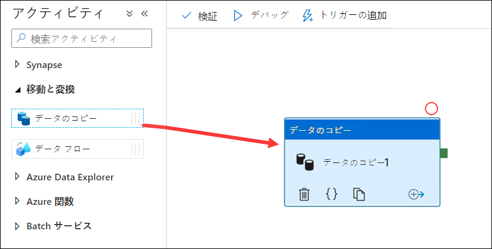

5. キャンバス上の「**データのコピー**」アクティビティを選択します。次に、キャンバスの下の「**全般**」タブで、アクティビティの**名前**を「**`Copy Sales`**」に設定します。

    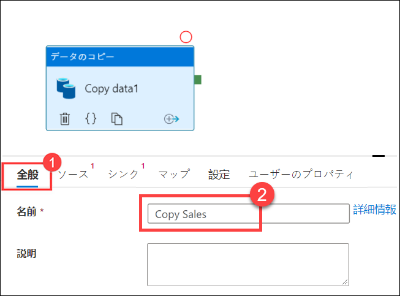

6. 「**ソース**」タブを選択し、「**+ 新規**」を選択して新しいソース データセットを作成します。

    

7. 「**Azure Data Lake Storage Gen2**」データ ストアを選択してから、「**続行**」を選択します。

    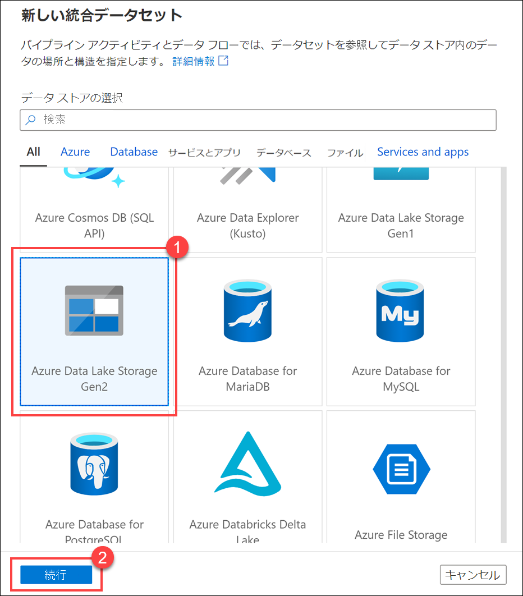

8. 「**Parquet**」形式を選び、「**続行**」を選択します。

    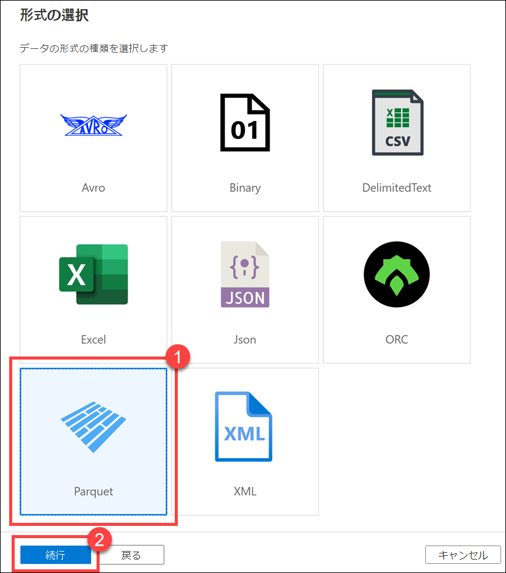

9. 「**プロパティの設定**」ウィンドウで、
    1. 名前を **`asal400_december_sales`** に設定します。
    2. **asadatalake*xxxxxxx*** リンク サービスを選択します。
    3. **wwi-02/campaign-analytics/sale-20161230-snappy.parquet** ファイルを参照します。
    4. スキーマ インポートの場合は、「**サンプル ファイルから**」を選択します。
    5. 「**ファイルの選択**」フィールドで、**C:\dp-203\data-engineering-ilt-deployment\Allfiles\samplefiles\sale-small-20100102-snappy.parquet** を参照します。
    6. 「**OK**」を選択します。

    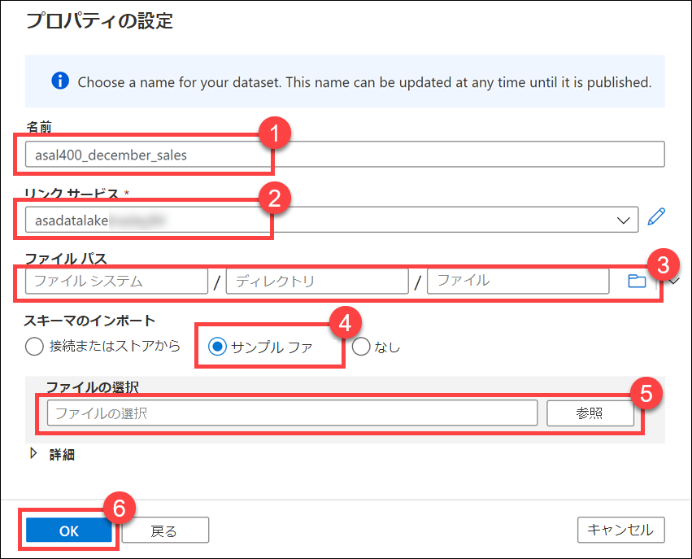

    まったく同じスキーマが含まれていて、サイズがはるかに小さいサンプル Parquet ファイルをダウンロードしました。これは、コピーするファイルが、コピー アクティビティ ソース設定で自動的にスキーマを推論するには大きすぎるためです。

10. 「**シンク**」タブを選択し、「**+ 新規**」を選択して新しいシンク データセットを作成します。

    

11. 「**Azure Synapse Analytics**」データ ストアを選択してから「**続行**」を選択します。

    

12. 「**プロパティの設定**」ウィンドウで、
    1. **名前**を **`asal400_saleheap_asa`** に設定します
    2. **sqlpool01_import01** リンク サービスを選択します。
    3. **wwi_perf.Sale_Heap** テーブルを選択します
    4. 「**OK**」を選択します。

    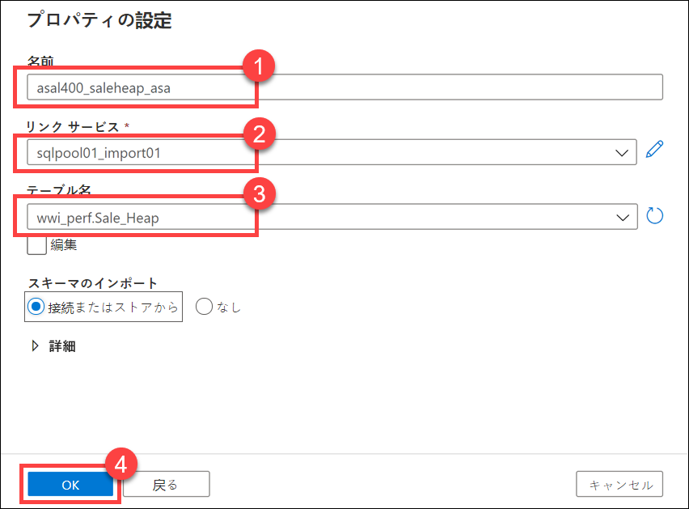

13. 「**シンク**」タブで「**Copy コマンド**」のコピー メソッドを選択し、コピー前のスクリプトに以下のコードを入力して、インポート前にテーブルをクリアします。

    ```
    TRUNCATE TABLE wwi_perf.Sale_Heap
    ```

    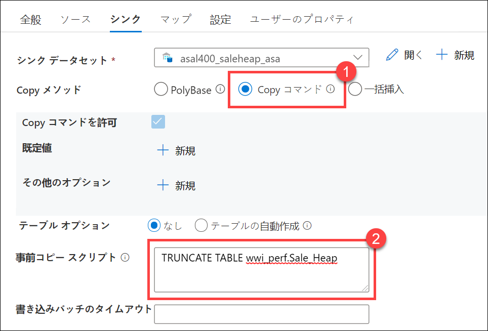

    最速で最もスケーラブルなデータの読み込み方法は、PolyBase または COPY ステートメントを使用することです。COPY ステートメントは、スループットの高いデータを SQL プールに取り込む最も柔軟性の高い方法です。

14. 「**マッピング**」タブを選択してから「**スキーマのインポート**」を選択し、各ソースおよび宛先フィールドのマッピングを作成します。ソース列で **TransactionDate** を選択し、**TransactionDateId** 宛先列にマッピングします。

    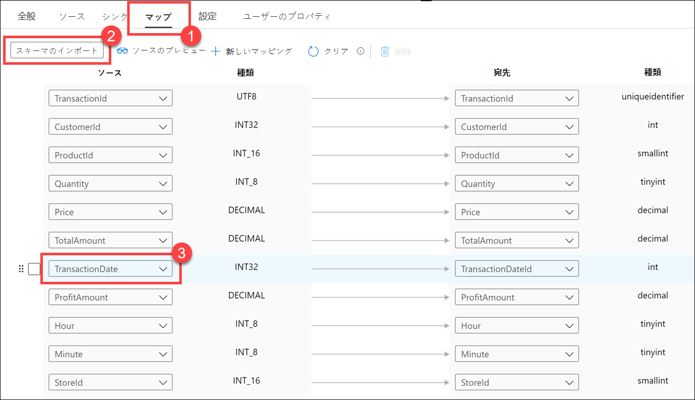

15. 「**設定**」タブを選択し、「**データ統合ユニット**」を **8** に設定します。ソース Parquet ファイルが大きいため、この操作が必要になります。

    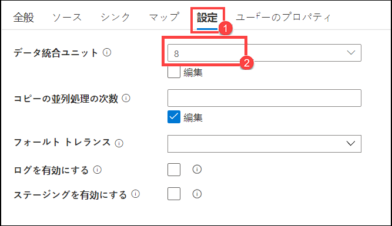

16. 「**すべて公開**」を選択した後、**公開**して新しいリソースを保存します。

    

17. 「**トリガーの追加**」を選択してから、「**今すぐトリガー**」を選択します。次に、「**パイプライン実行**」ウィンドウで「**OK**」を選択して、パイプラインを開始します。

    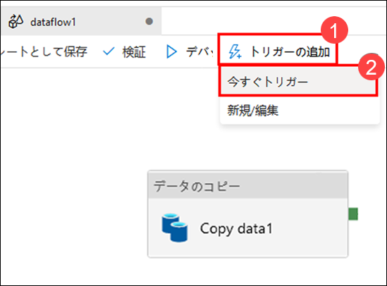

18. 「**監視**」ハブに移動します。

    

19. 「**パイプライン実行**」を選択します。パイプライン実行のステータスはここで確認できます。ビューを更新する必要があるかもしれません。パイプライン実行が完了したら、**wwi_perf.Sale_Heap** テーブルのクエリを行い、インポートされたデータを表示できます。

    

## 重要: SQL プールを一時停止する

これらの手順を実行して、不要になったリソースを解放します。

1. Synapse Studio で「**管理**」ハブを選択します。
2. 左側のメニューで「**SQL プール**」を選択します。**SQLPool01** 専用 SQL プールにカーソルを合わせ、選択します **||**。

    

3. プロンプトが表示されたら、「**一時停止**」を選択します。
