---
lab:
    title: 'Stream Analytics によるリアルタイムのストリーム処理'
    module: 'モジュール 10'
---

# ラボ 10 - Stream Analytics によるリアルタイムのストリーム処理

このラボでは、Azure Stream Analytics を使用してストリーミング データを処理する方法を学習します。車両のテレメトリ データを Event Hubs に取り込んだ後、Azure Stream Analytics のさまざまなウィンドウ化関数を使用してリアルタイムでそのデータを処理します。データは Azure Synapse Analytics に出力されます。最後に、スループットを増やすために Stream Analytics ジョブのスケーリングを行う方法を学びます。

このラボを完了すると、次のことができるようになります。

- Stream Analytics を使用して Event Hubs からリアルタイムのデータを処理する
- Stream Analytics ウィンドウ化関数を使用して、集計と Synapse Analytics への出力を構築する
- Azure Stream Analytics ジョブをスケーリングし、パーティション分割によってスループットを増やす
- ストリーム入力の分割をやり直し、並列処理を最適化する

## テクノロジの概要

### Azure Stream Analytics

接続されているさまざまなデバイスやセンサーから生成されるデータ量の増加に伴い、現在、ほぼリアルタイムでこのデータを使用可能な分析情報と予測に変換することが運用で必要になってきています。[Azure Stream Analytics](https://docs.microsoft.com/azure/stream-analytics/stream-analytics-introduction) は、お使いになっているリアルタイムのアプリケーション アーキテクチャとシームレスに統合し、量に関わりなくデータに関するリアルタイムの強力な分析を可能にします。

Azure Stream Analytics を使用すると、超並列型の複雑なイベント処理 (CEP) パイプラインを容易に作成できます。一時的なロジックのサポートが組み込まれた非常にシンプルな宣言型の [SQL に類似した言語](https://docs.microsoft.com/stream-analytics-query/stream-analytics-query-language-reference)を使用して協力なリアルタイムの強力な分析ソリューションを作成できます。広範な[既定のコネクタ](https://docs.microsoft.com/azure/stream-analytics/stream-analytics-define-outputs)、高度なデバッグ、ジョブ管理機能により、開発者に必要なスキルを大幅に減らす一方、コストを抑えられます。さらに、Azure Stream Analytics は高度な拡張性を備え、[JavaScript ユーザー定義関数](https://docs.microsoft.com/azure/stream-analytics/stream-analytics-javascript-user-defined-functions)によるカスタム コードに対応しており、SQL に書き込まれたストリーミング ロジックをさらに延長できます。

Azure Stream Analytics では、懸念すべきインフラストラクチャや、管理の必要なサーバー、仮想マシン、クラスターはないので、あっという間に使い始められます。どのようなジョブでも、ひとつのストリーミング ユニットから数百にいたるまで、[処理能力を即時スケールアウト](https://docs.microsoft.com/azure/stream-analytics/stream-analytics-streaming-unit-consumption)できます。料金は、ジョブ 1 件当たりに使用した処理量に応じて発生します。

[保証付きのイベント 配信](https://docs.microsoft.com/stream-analytics-query/event-delivery-guarantees-azure-stream-analytics)とエンタープライズ レベルの SLA により、3 つの「9」を利用でき、ミッション クリティカルなワークロードに Azure Stream Analytics が適していることを確認できます。自動チェックポイントを備えているため、フォールト トレラントな操作が可能で、データを損失することなく、すぐに再起動できます。

### Azure Event Hubs

[Azure Event Hubs](https://docs.microsoft.com/azure/event-hubs/event-hubs-about) は、毎秒数百万のイベントを取り込むことのできるビッグ データ パイプラインです。HTTPS、AMQP、AMQP のような標準プロトコルを WebSocket や Kafka で使用し、テレメトリおよびイベント ストリーム データのキャプチャ、保持、再生を促します。データは多数の同時ソースからもたらされる可能性があり、最大 20 のコンシューマー グループが独自のペースで独立してアプリケーションを使い、イベント ハブ全体を読み取ることができます。

## シナリオの概要

Contoso Auto は車両テレメトリを収集しており、Event Hubs を利用して迅速にデータを取り込み、生データとして格納し、ほぼリアルタイムで何らかの処理を行いたいと考えています。最終的には、処理後の新しいデータを受信して自動的に更新されるダッシュボードの作成を希望しています。このダッシュボードには、エンジンの加熱や異常な油圧、攻撃的な運転など検出された異常を示すさまざまな可視化機能を備えることを望んでいます。都市に関する異常を示すマップや、この情報を明確に表す多様なグラフなどのコンポーネントを使用できます。

ここでは、Azure Event Hubs を使用し、Event Hubs、Azure Stream Analytics、Azure Synapse Analytics に基づいて構築されたほぼリアルタイムの分析パイプラインの入り口としててストリーミング車両テレメトリ データを取り込みます。Azure Stream Analytics は Event Hubs から車両センサー データを抽出し、特定の時間枠で集計を行い、データの分析を行えるように集計データを Azure Synapse Analytics に送信します。車両テレメトリ データ ジェネレーターを使用して、車両テレメトリ データを Event Hubs に送信します。

## ラボの構成と前提条件

このラボを開始する前に、**ラボ 4: *Apache Spark を使用してデータの探索と変換を行い、データ ウェアハウスに読み込む***を完了してください。

このラボでは、前のラボで作成した専用 SQL プールを使用します。前のラボの最後で SQL プールを一時停止しているはずなので、次の手順に従って再開します。

1. Azure Synapse Studio (<https://web.azuresynapse.net/>) を開きます。
2. 「**管理**」ハブを選択します。
3. 左側のメニューで「**SQL プール**」を選択します。**SQLPool01** 専用 SQL プールが一時停止状態の場合は、名前の上にマウスを動かして、「**&#9655;**」を選択します。

    

4. プロンプトが表示されたら、「**再開**」を選択します。プールが再開するまでに、1 ～ 2 分かかります。
5. 専用 SQL プールが再開する間、続行して次の演習に進みます。

> **重要:** 開始されると、専用 SQL プールは、一時停止されるまで Azure サブスクリプションのクレジットを消費します。このラボを休憩する場合、またはラボを完了しないことにした場合は、ラボの最後にある指示に従って、SQL プールを一時停止してください。

## 演習 1 - サービスを構成する

Azure Event Hubs はビッグ データ ストリーミング プラットフォームであり、毎秒数百万のイベントを受け取って処理できるイベント インジェスト サービスです。これを使用して、処理が行われ、リアルタイムのダッシュボードへの送信準備ができている車両テレメトリ データを一時的に格納します。データは Event Hubs に移されるため、Azure Stream Analytics はデータのクエリを行い、集計を適用して異常にタグを付け、Azure Synapse Analytics に送信します。

### タスク 1: Event Hubs を構成する

このタスクでは、提供された Event Hubs 名前空間内で新しいイベント ハブを作成して構成します。これを使用して、処理後の車両テレメトリを捕捉し、後ほど作成する Azure 関数で強化します。

1. [Azure portal](https://portal.azure.com) を参照します。

2. 左側のメニューで、「**リソース グループ**」を選択します。次に、**data-engineering-synapse-*xxxxxxx*** リソース グループを選択します。

3. **eventhub*xxxxxxx*** Event Hubs 名前空間を選択します。

    

4. 「Event Hubs 名前空間」ブレードで、左側のメニューで「**Event Hubs**」を選択します。

    

5. **telemetry** イベント ハブを選択します。

    

6. 左側のメニューで「**共有アクセス ポリシー**」を選択します。

    

7. 最上部のツールバーで「**+ 追加**」を選択し、新しい共有アクセス ポリシーを作成します。

    

8. 「**SAS ポリシーの追加**」ブレードで以下のように構成します。

    - **名前:** `Read`
    - **マネージド:** オフ
    - **送信:** オフ
    - **リッスン:** オン

        

        > イベントの読み取り、書き込み、管理で別個のポリシーを作成するのがベスト プラクティスです。サービスとアプリケーションが許可のない操作を行うことを防ぐため、裁定権限の原則に従います。

9. 値の入力が終わったら、フォームの最下部で「**作成**」を選択します。

10. 最上部のツールバーで「**+ 追加**」を選択し、2 番目に新しい共有アクセス ポリシーを作成します。

    

11. 「**SAS ポリシーの追加**」ブレードで以下のように構成します。

    - **名前:** `Write`
    - **マネージド:** オフ
    - **送信:** オン
    - **リッスン:** オフ

        

12. 値の入力が終わったら、フォームの最下部で「**作成**」を選択します。

13. リストからご自分の**書き込み**ポリシーを選択します。フィールドの右側で「コピー」ボタンを選択して、「**接続文字列 - 主キー**」の値をコピーします。メモ帳や他のテキスト エディターにこの値を保存して、後ほど使えるようにします。

    

### タスク 2: Synapse Analytics を構成する

Azure Synapse はエンドツーエンドの分析プラットフォームで、SQL データ ウェアハウス、ビッグ データ分析、単一の環境へのデータ統合を組み合わせます。ユーザーは、あらゆるデータにすばやくアクセスして分析情報を得られるので、業界で比類のない新しいレベルのパフォーマンスとスケーリングが可能です。

このタスクでは、Synapse 専用 SQL プールでテーブルを作成し、Stream Analytics ジョブ (Event Hubs で取り込まれた車両テレメトリを処理) によって提供された集計車両データを格納します。

1. Azure Synapse Studio で、「**データ**」ハブを選択します。

    

2. 「**ワークスペース**」タブを選択し、**データベース**を展開して、「**SQLPool01**」を右クリックします。次に、「**新しい SQL スクリプト**」、「**空のスクリプト**」の順に選択します。

    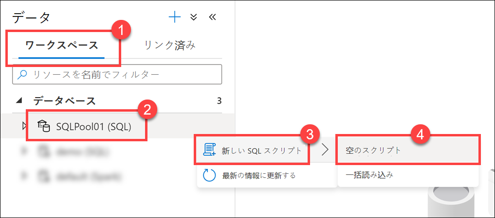

3. スクリプトが **SQLPool01** に接続されていることを確認し、スクリプトを次のように置き換えて「**実行**」を選択し、新しいテーブルを作成します。

    ```sql
    CREATE TABLE dbo.VehicleAverages
    ( 
        [AverageEngineTemperature] [float] NOT  NULL,
        [AverageSpeed] [float] NOT  NULL,
        [Snapshot] [datetime] NOT  NULL
    )
    WITH
    (
        DISTRIBUTION = ROUND_ROBIN,
        CLUSTERED COLUMNSTORE INDEX
    )
    GO
    ```

    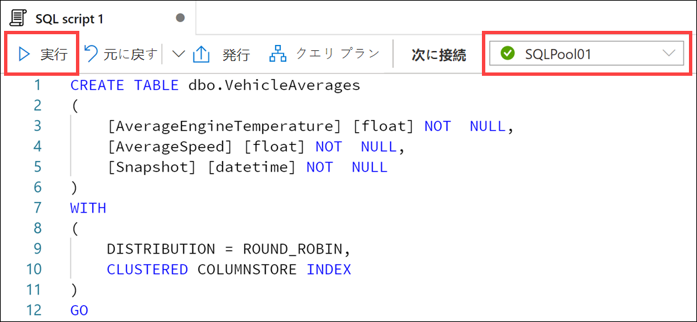

### タスク 3: Stream Analytics を構成する

Azure Stream Analytics は、デバイスからの大量のデータ ストリームを分析することができるイベント処理エンジンです。受信データは、デバイス、センサー、Web サイト、ソーシャル メディア フィード、アプリケーションなどから得ることができます。また、データ ストリームから情報を抽出し、パターンや関係を把握することもできます。これらのパターンを使用して、アラートの作成、レポート ツールへの情報のフィード、後で使用するための情報の保存など、別のアクションをダウンストリームでトリガーすることができます。

このタスクでは、Stream Analytics を構成し、作成済みのイベント ハブをソースとして使用し、そのデータのクエリと分析を行います。

1. Azure portal の **data-engineering-synapse-*xxxxxxx*** リソース グループで、 **as*xxxxxxx*** Stream Analytics ジョブを選択します。

    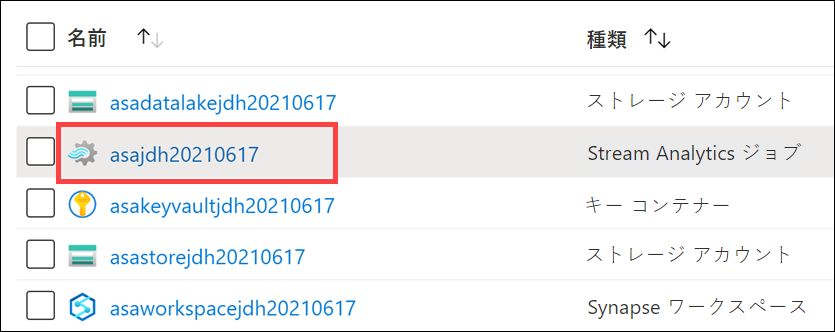

2. Stream Analytics ジョブ内で左側のメニューから「**ストレージ アカウント設定**」を選択し、「**ストレージ アカウントの設定**」を選択します。出力のひとつとして Synapse Analytics を使用するので、まず、ジョブ ストレージ アカウントを構成する必要があります。

    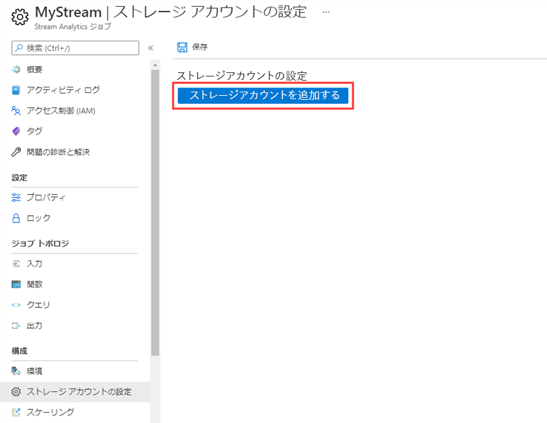

3. 「**ストレージ アカウント設定**」フォームで次のように構成します。

   - **サブスクリプションからストレージ アカウントを選択する:** 選択します。
   - **サブスクリプション:** このラボで使用するサブスクリプションが選択されていることを確認します。
   - **ストレージ アカウント:** **asadatalake*xxxxxxx*** という名前のストレージ アカウントを選択します。
   - **認証モード**:「接続文字列」を選択します。

        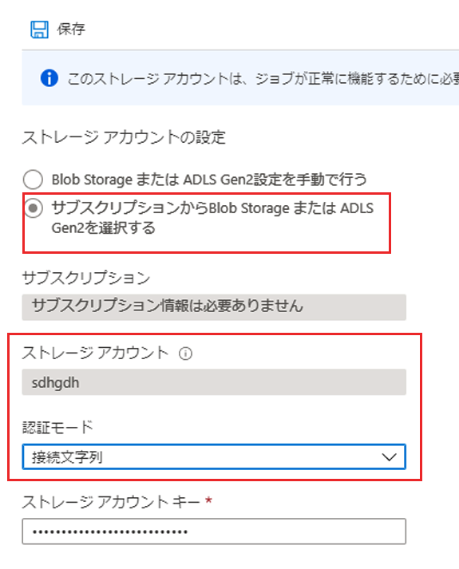

4. 「**保存**」を選択した後、プロンプトで指示されたら「**はい**」を選択し、ストレージ アカウントの設定を保存します。

5. Stream Analytics ジョブの左側のメニューで「**入力**」を選択します。

    

6. 最上部のツールバーで「**+ ストリーム入力を追加**」を選択してから「**イベント ハブ**」を選択し、新しいイベント ハブ入力を作成します。

    

7. 「**新しい入力**」ブレードで次のように構成します。

    - **名前:** `eventhub`
    - **サブスクリプションからイベント ハブを選択する:** オン
    - **サブスクリプション:** このラボで使用するサブスクリプションが選択されていることを確認します。
    - **イベント ハブの名前空間:** **eventhub*xxxxxxx*** Event Hubs 名前空間を選択します。
    - **イベント ハブ名**:「**既存のものを使用**」を選択し、先ほど作成した**テレメトリ**を選択します。
    - **イベント ハブ コンシューマー グループ**:「**既存のものを使用**」を選択してから、「**$Default**」を選択します。
    - **認証モード**:「**接続文字列**」を選択します。
    - **イベント ハブ ポリシー名**:「**既存のものを使用**」を選択してから、「**読み取り**」を選択します。
    - その他の値はすべて、既定のままにします。

        

8. 値の入力が終わったら、フォームの最下部で「**保存**」を選択します。

9. Stream Analytics ジョブ ブレードの左側のメニューで「**出力**」を選択します。

    

10. 最上部のツールバーで「**+ 追加**」を選択してから「**Azure Synapse Analytics**」を選択し、新しい Synapse Analytics 出力を作成します。

    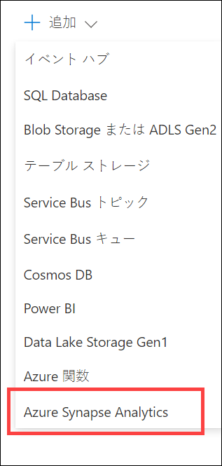

11. 「**新しい出力**」ブレードで次のように構成します。

    - **出力エイリアス:** `synapse`
    - **サブスクリプションから Azure Synapse Analytics を選択する:** 選択します。
    - **サブスクリプション:** このラボで使用しているサブスクリプションを選択します。
    - **データベース**:「**SQLPool01**」を選択します。適正な Synapse ワークスペース名が「**サーバー名**」に表示されていることを確認します。
    - **認証モード**:「**接続文字列**」を選択します。
    - **ユーザー名**: `asa.sql.admin`
    - **パスワード:** ラボ環境の展開時に入力した、またはホストされたラボ環境の一部として提供された SQL 管理者パスワードの値を入力します。SQL 管理者のユーザー名がわからない場合は、Azure リソース グループの Synapse ワークスペースに移動します。SQL 管理者ユーザー名は、「概要」ペインに表示されます。
    - **サーバー名**: asaworkspace*xxxxxxx*
    - **表:** `dbo.VehicleAverages`

        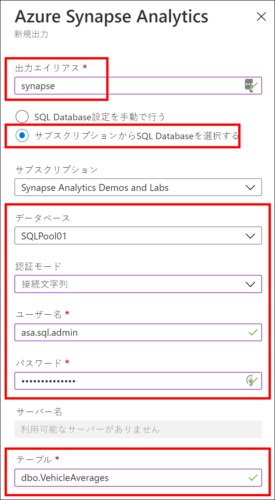

        > **注:** SQL 管理者のユーザー名がわからない場合は、Azure リソース グループの Synapse ワークスペースに移動します。SQL 管理者ユーザー名は、「概要」ペインに表示されます。

        

12. 値の入力が終わったら、フォームの最下部で「**保存**」を選択します。

13. Stream Analytics ジョブ ブレードの左側のメニューで「**クエリ**」を選択します。

    

14. 次のクエリを入力します。

    ```sql
    WITH
    VehicleAverages AS (
        select
            AVG(engineTemperature) averageEngineTemperature,
            AVG(speed) averageSpeed,
            System.TimeStamp() as snapshot
        FROM
            eventhub TIMESTAMP BY [timestamp]
        GROUP BY
            TumblingWindow(Duration(minute, 2))
    )
    -- INSERT INTO SYNAPSE ANALYTICS
    SELECT
        *
    INTO
        synapse
    FROM
        VehicleAverages
    ```

    

    クエリは 2 秒間のエンジン温度と速度を平均化します。このクエリは、**TumblingWindow(Duration(minute, 2))** を使用して過去 2 分間のあらゆる車両の平均エンジン温度および速度を集計し、これらのフィールドを **synapse** に出力します。

15. クエリの更新が終了したら、最上部のツールバーで「**クエリの保存**」を選択します。

16. Stream Analytics ジョブ ブレードの左側のメニューで「**概要**」を選択します。「概要」ブレードの上で「**開始**」を選択します。

    

19. 表示された「ジョブの開始」ブレードで、ジョブ出力開始時間の「**今すぐ**」を選択してから「**開始**」を選択します。これにより Stream Analytics ジョブが始まるので、イベントを処理して Azure Synapse Analytics に送信する準備ができます。

    

## 演習 2 - データを生成および集計する

### タスク 1: データ ジェネレーターを実行する

データ ジェネレーターのコンソール アプリケーションが車両 (車両識別番号 (VIN) で表示) の配列向けにシミュレートされた車両センサー テレメトリを作成し、直接 Event Hubs に送信します。そのためには、まず、イベント ハブ接続文字列を使用して構成する必要があります。

このタスクでは、データ ジェネレーターを構成して実行します。データ ジェネレーターはシミュレートされた車両テレメトリ データを Event Hubs に保存します。これにより、Stream Analytics ジョブは強化されたデータを集計して分析し、Synapse Analytics に送信します。

1. ラボ VMで、Windows エクスプローラーを使用して、**c:\dp-203\data-engineering-ilt-deployment\Allfiles** フォルダーを表示します。
2. **TransactionGenerator.zip** アーカイブを **TransactionGenerator** という名前のサブフォルダーに抽出します。
3. 抽出した **TransactionGenerator** フォルダーで、**appsettings.json** ファイルを開きます。**EVENT_HUB_CONNECTION_STRING** の隣に **telemetry** Event Hub 接続文字列の値を貼り付けます。以下のように値のまわりには必ず引用符 ("") を使用してください。ファイルを**保存**します。

    

    > **注:** *接続文字列が EntityPath = telemetry で終わっていることを確認してください* (例: *Endpoint=sb://YOUR_EVENTHUB_NAMESPACE.servicebus.windows.net/;SharedAccessKeyName=Write;SharedAccessKey=REDACTED/S/U=;EntityPath=telemetry*)。そうでない場合は、イベント ハブの**書き込み**ポリシーから接続文字列をコピーしていません。

    SECONDS_TO_LEAD は、車両テレメトリ データを送信する前に待つ時間です。既定値は 0 です。

    SECONDS_TO_RUN は、データの送信を止めるまでジェネレーターを実行できる最大時間です。既定値は 1800 です。ジェネレーターの実行中に Ctrl+C を押すか、ウィンドウを閉じて、データの送信を止めることもできます。

4. 抽出した **TransactionGenerator** フォルダーで、**TransactionGenerator.exe** を実行します。

5. 「**Windows で保護された PC**」 ダイアログが表示された場合は、「**詳細情報**」を選択し、「**とにかく実行**」を選択します。

    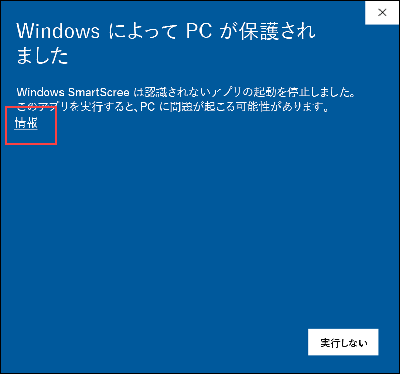

    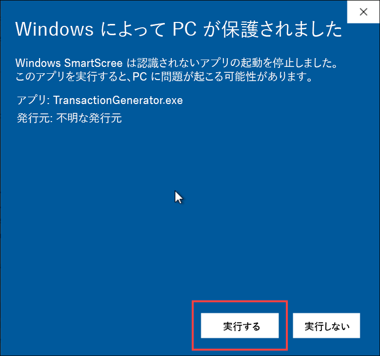

6.  新しいコンソール ウィンドウが開き、数秒後にデータの送信が始まるはずです。Event Hubs にデータが送信されるようになったら、ウィンドウを_最小化_して背景で実行中のままにします。次のステップに進む前に、これを最低 3 分間実行してください。

    

    500 件の記録の送信が要求されるたびに、出力統計情報が表示されます。

### タスク 2: synapse Analytics で集計データを表示する

Stream Analytics でクエリを作成した際は、2 分間隔でエンジン温度と車両の速度データを集計し、そのデータを Synapse Analytics に保存しました。この機能は、Stream Analytics のクエリがさまざまな間隔で複数の出力にデータを書き込めることを示しています。Synapse Analytics 専用 SQL プールに書き込めるため、履歴および最新の集計データをデータ ウェアハウスの一部として保持できます。ETL/ELT プロセスは必要ありません。

このタスクでは、Synapse Analytics 内の異常データを表示します。

1. Synapse Studio で左側のメニューにある「**データ**」を選択して、「データ」ハブに移動します。

    

2. 「**ワークスペース**」タブを選択し、**SQLPool01** データベースを展開し、「**テーブル**」を展開して、**dbo.VehicleAverages** テーブルを右クリックします (テーブルが表示されていない場合は、テーブル リストを更新します)。「**新しい SQL スクリプト**」を選択してから「**上位 100 行を選択**」を選びます。

    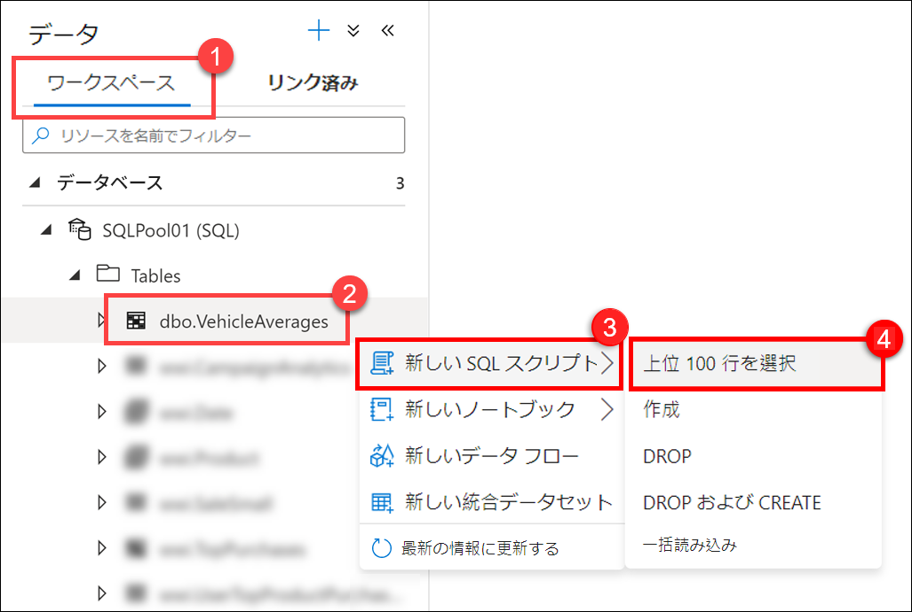

3. クエリを実行して結果を確認します。**AverageEngineTemperature** と **AverageSpeed** に保存されている集計データを観察します。これらの記録の間で **Snapshot** の値は 2 分間隔で変化します。

   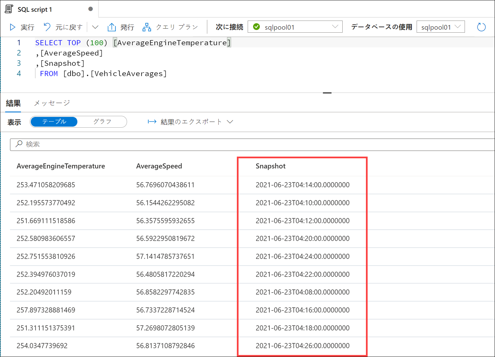

4. 「結果」出力で「**グラフ**」ビューを選択し、グラフの種類を「**面グラフ**」に設定します。この視覚化では、時間の経過に伴う平均速度に関連した平均エンジン温度が示されます。グラフの設定をいろいろ試してみてください。データ ジェネレータの実行時間が長いほど、より多くのデータ ポイントが生成されます。次の視覚化は、10 分以上実行されたセッションの例であり、画面に表示されているものを表していない場合があります。

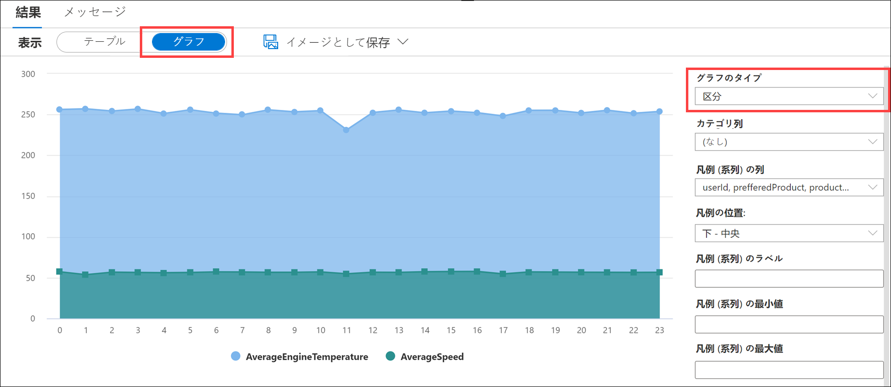

## 重要: クリーンアップ

これらの手順を実行して、データ ジェネレーターを停止し、不要になったリソースを解放します。

### タスク 1: データ ジェネレーターを停止する

1. データ ジェネレーターが実行されているコンソール/ターミナル ウィンドウに戻ります。ウィンドウを閉じてジェネレーターを停止します。

### タスク 2: Stream Analytics ジョブの停止

1. Azure portal で Stream Analytics ジョブに移動します。

2. 「概要」ペインで、「**停止**」を選択し、プロンプトが表示されたら「**はい**」を選択します。

    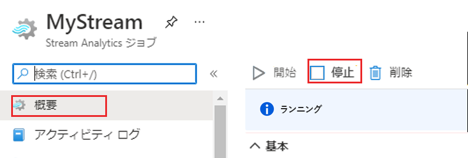

### タスク 3: 専用 SQL プールを一時停止する

これらの手順を実行して、不要になったリソースを解放します。

1. Synapse Studio で「**管理**」ハブを選択します。
2. 左側のメニューで「**SQL プール**」を選択します。**SQLPool01** 専用 SQL プールにカーソルを合わせ、選択します **||**。

    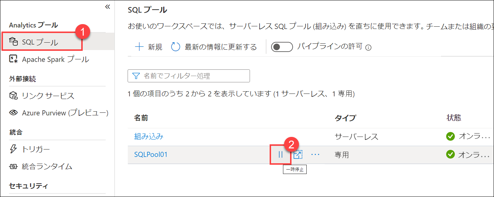

3. プロンプトが表示されたら、「**一時停止**」を選択します。
